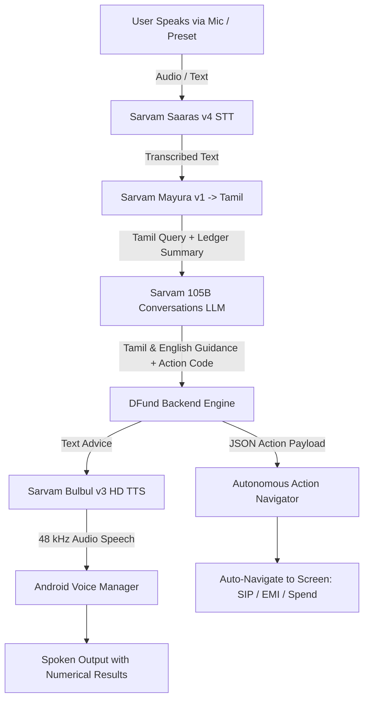

# 🚀 DFund — Next-Gen AI Financial Advisor & Micro-SIP Automation

> **Autonomous personal finance and micro-investment platform for gig economy workers, freelancers, and families.**  
> Powered by **Sarvam AI Full Indian Regional AI Suite (Sarvam 105B LLM, Saaras v4 STT, Mayura v1 Translation, Bulbul v3 TTS)** and **Native Android Material 3**.

[-green.svg)](https://developer.android.com/)
[](https://fastapi.tiangolo.com/)
[](https://sarvam.ai/)
[](https://sarvam.ai/)
[](https://m3.material.io/)
[](LICENSE)

---

## 🌟 Core Highlights

### 🎙️ 1. All-in-One Sarvam AI Indian Regional Intelligence Pipeline
DFund runs entirely on Sarvam AI's flagship models, purpose-built for Indian linguistic and financial contexts:
- **Speech-to-Text (STT)**: **Sarvam Saaras v4** (`saaras:v4`) — 23 Indian languages with auto language detection and noise robustness.
- **Cross-Lingual Bridge**: **Sarvam Mayura v1** (`mayura:v1`) — Translates spoken queries into Tamil (`ta-IN`) with tone and script control.
- **Financial Reasoning & Tool Calling**: **Sarvam 105B Conversations** (`sarvam-105b-conversations`) — 105B parameter LLM deeply trained on Indian personal finance, analyzing live ledger cashflow, calculating compound interest, and emitting actionable in-app commands.
- **Text-to-Speech (TTS)**: **Sarvam Bulbul v3** (`bulbul:v3`) — 48 kHz HD neural voice speaking back in the user's native tongue (Tamil, English, Telugu, or Malayalam).
- **On-Device Offline Fallback**: Built-in `LocalAiIntentParser` ensures the voice assistant continues working smoothly even when offline.



---

### ⚡ 2. Zero-Click Autonomous Voice Execution
Say goodbye to tedious manual confirmation prompts:
- **Autonomous Navigation**: When the user speaks a query, the assistant displays a brief 1.2s advice card stating the action taken and the result, and **automatically transitions** to the relevant screen (SIP Calculator, Transactions, EMI list, etc.).
- **Unambiguous Spoken Results**: The voice assistant explicitly announces:
  1. **What was done** (*"Calculated SIP for ₹500/month for 3 years"*)
  2. **Exact numerical results** (*"Total invested is ₹18,000, and expected maturity value is ₹21,753 with ₹3,753 gain."*)
- **Background Voice Continuity**: Speech playback continues uninterrupted even during screen transitions.

---

### 📩 3. Zero-Touch Automated SMS & Notification Reader
- **Automatic Inbox Ingestion**: Scans device SMS inbox on app launch (`onCreate` / `onResume`) without user intervention.
- **Intelligent UPI Parser**: `UpiSmsParser` parses bank alerts across major Indian banks (SBI, HDFC, ICICI, Axis, Paytm, PhonePe, GPay) extracting:
  - Amount, Debit/Credit type, Merchant/Category (`FOOD`, `TRAVEL`, `GROCERY`, `EMI`, `UTILITIES`), VPA handles, and UTR reference numbers.
- **Deduplication Engine**: Cryptographic checks prevent duplicate entries on repeated scans.

---

### 🌓 4. Instant 1-Tap Obsidian Dark & Clean White Themes
- **Modern Fintech Aesthetic**: Inspired by Toss and Apple Wallet design paradigms with elevated surface cards, vibrant status pills, and high-legibility typography.
- **Obsidian Dark Palette**: `#0B0F17` Midnight Canvas, `#131B2A` Surface Cards, and `#1E293B` Borders.
- **Dynamic Header Toggle**: 1-tap round toggle button with adaptive icons (Crescent moon in Light Mode, Radiant sun in Dark Mode).
- **Encrypted Persistence**: Preserves user theme preference across app restarts via `SecurityManager`.

---

### 🛡️ 5. Dynamic Safety Shield & Micro-SIP Compounding Engine
- **3-Month Living Cushion**: Calculates the minimum safety buffer needed for rent, groceries, and EMIs before allocating surplus funds.
- **Micro-SIP Growth Engine**: Real-time compound interest projections with interactive sliders (₹100 to ₹10,000/mo and 1 to 15 years).
- **Comparative Wealth Projections**: Visual side-by-side comparison:
  - Idle Bank Account (3% p.a.)
  - Fixed / Recurring Deposit (7% p.a.)
  - Micro-SIP Mutual Funds (12% p.a.)

---

### 🌐 6. Native Multilingual Support
Full native UI and voice support across 4 languages:
- 🇬🇧 English (`en`)
- 🇮🇳 தமிழ் (Tamil - `ta`)
- 🇮🇳 తెలుగు (Telugu - `te`)
- 🇮🇳 മലയാളം (Malayalam - `ml`)

---

## 📂 Repository Structure

```text
Dfund/
├── DFund-app-debug.apk          # Pre-built APK ready for direct 1-tap phone installation
├── build_apk.bat                # 1-Click script to compile Android APK via Gradle
├── run_on_phone.bat             # 1-Click script to build, install, port-forward, & launch on device
├── start_backend.bat            # 1-Click script to start FastAPI Uvicorn backend
├── PROJECT.md                   # Complete architectural guide, milestone history, & technical notes
├── .gitignore                   # Excludes .env, local.properties, build caches, and sensitive keys
│
├── android/                     # Android Native Application
│   ├── app/
│   │   ├── src/main/java/com/dfund/app/
│   │   │   ├── data/
│   │   │   │   ├── local/       # Room SQLite DB (Transactions, Goals, DAOs)
│   │   │   │   ├── remote/      # Retrofit2 HTTP Client & Voice Action Schemas
│   │   │   │   ├── security/    # EncryptedSharedPreferences (Theme, Language, Pin)
│   │   │   │   └── sms/         # UpiSmsParser, SmsInboxScanner, NotificationListener
│   │   │   ├── domain/          # FinancialMathEngine & LocalAiIntentParser
│   │   │   └── ui/
│   │   │       ├── voice/       # VoiceActiveDialogFragment & VoiceInteractionManager
│   │   │       ├── navigation/  # AiActionNavigator (Dynamic Screen Transition)
│   │   │       ├── adapters/    # TransactionAdapter & Chip Filters
│   │   │       └── viewmodels/  # MainViewModel & LiveData Reactive Pipeline
│   │   └── src/main/res/        # Material 3 XML Layouts, Day/Night Drawables, Multilingual Strings
│   └── build.gradle             # Android Gradle Dependencies
│
└── backend/                     # Python FastAPI AI Backend
    ├── app/
    │   ├── api/                 # Endpoints: /api/voice, /api/transactions, /api/savings
    │   ├── models/              # SQLAlchemy Database Models (PostgreSQL & SQLite)
    │   ├── schemas/             # Pydantic Schemas for Requests & Voice Payloads
    │   └── services/
    │       ├── sarvam_service.py # Saaras STT, Translation, & Bulbul v3 TTS Integration
    │       ├── ollama_service.py # Ollama Cloud Minimax-M3 Client & Fallback Engine
    │       └── financial_advisor.py # Dynamic Safety Shield & Surplus Bucketing
    ├── tests/                   # Pytest test suite for end-to-end backend validation
    ├── .env.example             # Safe template for API credentials
    ├── Dockerfile               # Containerization definition
    └── requirements.txt         # FastAPI, Uvicorn, httpx, SQLAlchemy dependencies
```

---

## 🚀 Quick Start Guide

### Prerequisites
- **Android Device or Emulator**: Android 8.0 (API 26) or higher, with Developer Mode and USB Debugging enabled.
- **Python 3.10+**: For the FastAPI backend.
- **Android SDK & ADB**: Configured on system PATH.

---

### Option A: Install Pre-Built APK (Fastest)
1. Connect your Android phone via USB with USB Debugging enabled.
2. Run in PowerShell / Command Prompt:
   ```cmd
   adb install -r DFund-app-debug.apk
   ```
3. Launch **DFund** from your app drawer!

---

### Option B: 1-Click Launch (Build & Run from Source)

1. **Configure Environment**:
   ```bash
   cd backend
   copy .env.example .env
   ```
   Add your credentials in `backend/.env`:
   ```env
   SARVAM_API_KEY=your_sarvam_api_key_here
   OLLAMA_API_KEY=your_ollama_api_key_here
   OLLAMA_BASE_URL=https://ollama.com/api
   OLLAMA_MODEL=minimax-m3:cloud
   ```

2. **Start Backend Server**:
   ```cmd
   start_backend.bat
   ```
   *Backend starts at `http://localhost:8000`.*

3. **Deploy App to Phone**:
   ```cmd
   run_on_phone.bat
   ```
   *This script automatically builds the APK, sets up `adb reverse tcp:8000 tcp:8000`, installs the app on your phone, and launches it!*

---

## 📡 API Reference

### `POST /api/voice/interact`
Handles multimodal voice audio or text prompts, translates to Tamil, queries Ollama Cloud Minimax-M3, and synthesizes regional voice speech.

- **Request Form Data**:
  - `audio_file` *(optional)*: WAV/MP3 recording from device microphone.
  - `text_prompt` *(optional)*: Text command (e.g., *"Calculate SIP for 500 rupees for 3 years"*).
  - `device_id` *(required)*: Unique client identifier.
  - `preferred_language`: Target response language (`ta`, `en`, `te`, `ml`).

- **Response JSON**:
  ```json
  {
    "transcription": "Calculate SIP for 500 rupees for 3 years",
    "detected_language": "en",
    "tamil_translation": "3 ஆண்டுகளுக்கு 500 ரூபாய்க்கு SIP கணக்கிடுங்கள்",
    "financial_suggestion": "மாதம் ₹500 வீதம் 3 ஆண்டுகளுக்கு SIP கணக்கிடப்பட்டது. மொத்த முதலீடு ₹18000, எதிர்பார்க்கப்படும் முதிர்வுத் தொகை ₹21753 (லாபம் ₹3753).",
    "action": {
      "action_type": "ACTION_OPEN_SIP_CALCULATOR",
      "parameters": {
        "amount": 500.0,
        "tenure_years": 3
      },
      "spoken_response": "Calculated SIP for ₹500/month for 3 years. Total invested is ₹18,000 with ₹21,753 maturity value."
    },
    "audio_base64": "<base64_encoded_audio>"
  }
  ```

---

## 🧪 Testing

### 1. Android Unit Tests
```cmd
cd android
.\gradlew.bat testDebugUnitTest
```
*Validates `FinancialMathEngine` compounding logic and `UpiSmsParser` regex against real Indian bank SMS formats.*

### 2. Backend Pytest Suite
```cmd
cd backend
python -m pytest tests/ -v
```
*Validates Sarvam voice integration, Ollama fallback reasoning, transaction ingestion, and SIP calculator endpoints.*

---

## 🛡️ Privacy & Security
- **Strictly Local SMS Processing**: SMS parsing executes 100% on-device inside `UpiSmsParser.java`. Bank account numbers and private OTPs are never transmitted to external servers.
- **Encrypted Shared Preferences**: Encrypted using Android Jetpack Security (`MasterKey` with AES256-GCM).
- **Environment Isolation**: `.env` files and developer credentials are strictly excluded via `.gitignore`.

---

## 📄 License
This project is licensed under the MIT License.

---

*Crafted with ❤️ for India's hardworking gig workers and everyday savers.*
